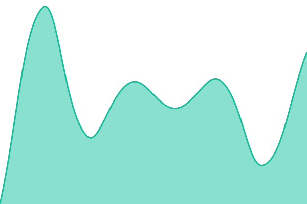
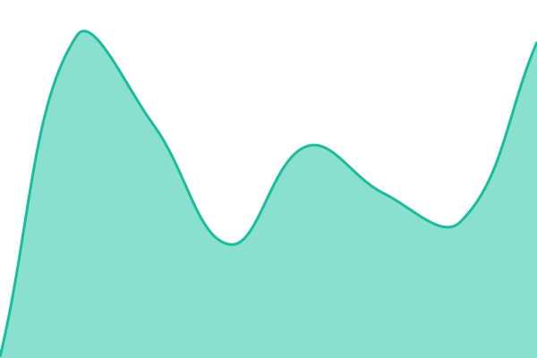

# [📈 Live Status](https://status.dozhost.qzz.io): <!--live status--> **🟩 All systems operational**

This repository contains the open-source uptime monitor and status page for [DozKooki](https://dozkooki.vercel.app/), powered by [Upptime](https://github.com/upptime/upptime).

<!--start: status pages-->
<!-- This summary is generated by Upptime (https://github.com/upptime/upptime) -->
<!-- Do not edit this manually, your changes will be overwritten -->
<!-- prettier-ignore -->
| URL | Status | History | Response Time | Uptime |
| --- | ------ | ------- | ------------- | ------ |
|  [DozHost Home](https://dozhost.qzz.io) | 🟩 Up | [doz-host-home.yml](https://github.com/DozKooki/dozhost-status/commits/HEAD/history/doz-host-home.yml) | 

 313ms
     
 | 

<a href="https://status.dozhost.qzz.io/history/doz-host-home">100.00%</a>
    

|  [DozHost Client Area](https://billing.dozhost.qzz.io) | 🟩 Up | [doz-host-client-area.yml](https://github.com/DozKooki/dozhost-status/commits/HEAD/history/doz-host-client-area.yml) | 

 595ms
     
 | 

<a href="https://status.dozhost.qzz.io/history/doz-host-client-area">95.04%</a>
    

|  [DozHost Status Page](https://status.dozhost.qzz.io) | 🟩 Up | [doz-host-status-page.yml](https://github.com/DozKooki/dozhost-status/commits/HEAD/history/doz-host-status-page.yml) | 

 254ms
     
 | 

<a href="https://status.dozhost.qzz.io/history/doz-host-status-page">100.00%</a>
    

<!--end: status pages-->

[**Visit our status website →**](https://status.dozhost.qzz.io)

## 📄 License

- Data in the `./history` directory: [Open Database License](https://opendatacommons.org/licenses/odbl/1-0/)
